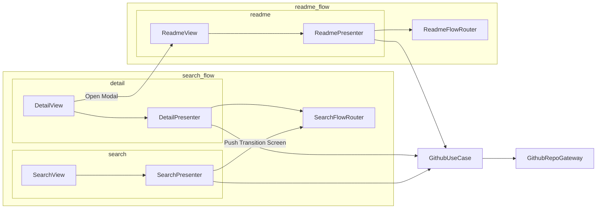

# GithubRepoSearcher-FlowRouter
[](https://github.com/mui-z/GithubRepoSearcher/blob/main/LICENSE)
[](https://github.com/mui-z/GithubRepoSearcher)

FlowRouter GitHub Repo Search App.


## About

This app architecture is based on Clean Architecture.

A `FlowRouter` exists for each Flow.

A `FlowRouter` is responsible for single flow control.





## Usage

```swift
protocol FlowRouter: Hashable {
    associatedtype PushRoute: Hashable
    associatedtype NextScreen: View

    var id: UUID { get }

    var navigationPath: NavigationPath { get set }

    var nextTransitionRoute: PushRoute { get }

    func triggerScreenTransition(route: PushRoute)
    func nextTransitionScreen() -> NextScreen
}
```

```swift
final class SearchFlowRouter: ObservableObject, FlowRouter {
    let id = UUID()

    @Published
    var navigationPath: NavigationPath = .init()

    private(set) var nextTransitionRoute: PushRoute = .unknown

    func triggerScreenTransition(route: PushRoute) {
        navigationPath.append(route)
        nextTransitionRoute = route
    }

    func nextTransitionScreen() -> some View {
        nextTransitionRoute.nextView(router: self)
    }
}

extension SearchFlowRouter {
    enum PushRoute: Hashable {
        case unknown
        case detail(repo: GithubRepo)

        func nextView(router: SearchFlowRouter) -> some View {
            switch self {
            case .detail(let repo):
                return DetailScreen(repo: repo, router: router)
            case .unknown:
                fatalError("no set next transition screen.")
            }
        }
    }
}
```


## Setup

1. You generate GitHub token. The only permission required is `public_repo`.

2. Paste to authorization header in [`GithubRepoGatewayImpl#searchGithubRepo()`](https://github.com/mui-z/GithubRepoSearcher/blob/main/GithubRepoSearcherPackage/Sources/GithubRepoSearcherPackage/Data/GatewayImpl/GithubRepoGatewayImpl.swift)

3. Build and Run App!

## Reference
- [Mastering NavigationStack in SwiftUI. Navigator Pattern - Swift with Majid](https://swiftwithmajid.com/2022/06/15/mastering-navigationstack-in-swiftui-navigator-pattern/)
- [The new NavigationStack & NavigationPath for SwiftUI - dev.to Duncan Kent](https://dev.to/kuncans/the-new-navigationstack-navigationpath-for-swiftui-5cpa)

## License

This is licensed under [MIT License](LICENSE)
